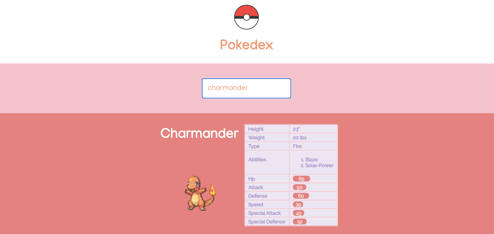

## Pokedex

Simple Pokedex app built using the [Pokemon Api](https://pokeapi.co/). The user has the ability to search through all the pokemons existing in the Pokemon Api database, and gets a "card" about the selected pokemon. The card has the following information: height, weight, type(s), abilities, and base stats.

## Current Issues / Future Improvements
Right now the basic functionality of the Pokedex is in place, but there's a lot to improve upon regarding current bugs/issues, and also adding more functionality. 

#### Current Issues/Bugs:
* Mobile responsiveness needs to be worked on
* When the search bar is empty and user clicks enter, right now user gets an error and app crashes
* Very rarely, some of the stats-bars gets outside of the table boundary

#### Future Improvements:
* Better restructing of files, to follow a more React based approach with each component having their own file.
* Instead of the homepage displaying the card of the searched pokemon with all the information, displaying just the sprite and making it clickable. The user can search for a pokemon, click on the sprite, and then get to the page with the pokemon card with the stats.
* Search bar auto-completion for all pokemon names.
* Doing a call to the Api to get the pokemon count instead of putting it in the App.js myself.

#### Possible Next Features:
* Be able to click through all the sprite of the selected pokemon, instead of just one.
* Add more information to the pokemon cards.
* Show the pokemon evolutions, be able to click through the different evolutions of a pokemon.
* Have the description of the abilities instead of just the name.

This project was bootstrapped with [Create React App](https://github.com/facebook/create-react-app).

## Available Scripts

In the project directory, you can run:

### `yarn start`

Runs the app in the development mode. 
Open [http://localhost:3000](http://localhost:3000) to view it in the browser.

The page will reload if you make edits. 
You will also see any lint errors in the console.

### `yarn test`

Launches the test runner in the interactive watch mode. 
See the section about [running tests](https://facebook.github.io/create-react-app/docs/running-tests) for more information.

### `yarn build`

Builds the app for production to the `build` folder. 
It correctly bundles React in production mode and optimizes the build for the best performance.

The build is minified and the filenames include the hashes. 
Your app is ready to be deployed!

See the section about [deployment](https://facebook.github.io/create-react-app/docs/deployment) for more information.

### `yarn eject`

**Note: this is a one-way operation. Once you `eject`, you can’t go back!**

If you aren’t satisfied with the build tool and configuration choices, you can `eject` at any time. This command will remove the single build dependency from your project.

Instead, it will copy all the configuration files and the transitive dependencies (webpack, Babel, ESLint, etc) right into your project so you have full control over them. All of the commands except `eject` will still work, but they will point to the copied scripts so you can tweak them. At this point you’re on your own.

You don’t have to ever use `eject`. The curated feature set is suitable for small and middle deployments, and you shouldn’t feel obligated to use this feature. However we understand that this tool wouldn’t be useful if you couldn’t customize it when you are ready for it.

## Learn More

You can learn more in the [Create React App documentation](https://facebook.github.io/create-react-app/docs/getting-started).

To learn React, check out the [React documentation](https://reactjs.org/).

### Code Splitting

This section has moved here: https://facebook.github.io/create-react-app/docs/code-splitting

### Analyzing the Bundle Size

This section has moved here: https://facebook.github.io/create-react-app/docs/analyzing-the-bundle-size

### Making a Progressive Web App

This section has moved here: https://facebook.github.io/create-react-app/docs/making-a-progressive-web-app

### Advanced Configuration

This section has moved here: https://facebook.github.io/create-react-app/docs/advanced-configuration

### Deployment

This section has moved here: https://facebook.github.io/create-react-app/docs/deployment

### `yarn build` fails to minify

This section has moved here: https://facebook.github.io/create-react-app/docs/troubleshooting#npm-run-build-fails-to-minify
